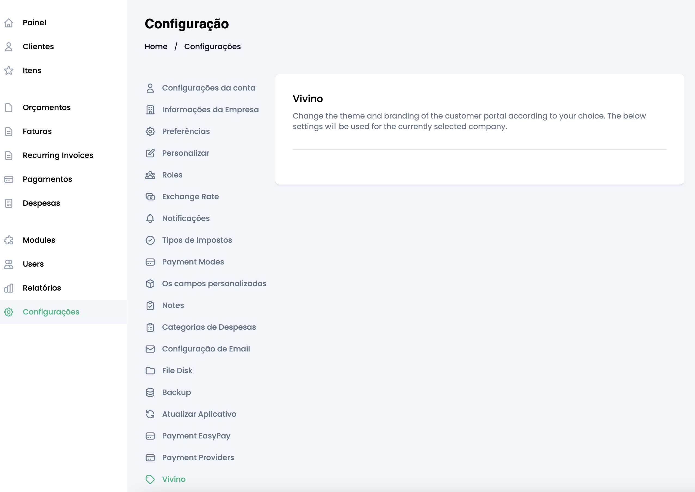

# Introduction

TESTE Laravel e vuejs

# Table of Contents

1. Faça o clone do project (o projecto corre via docker mas tambem funcionar via artisan serve)
2. Corra o seguinte comando : php artisan module:enable Vivino (veja se na tabela modules foi criado alguma coisa, por vezes ele nao ficar entao tem que se criar manualmente)
INSERT INTO `modules` (`id`, `name`, `version`, `installed`, `enabled`, `created_at`, `updated_at`) VALUES (4, 'Vivino', '1.0.0', 1, 1, NULL, NULL);
3. na pasta Modules tem o nosso projecto que vai fazer a validação, o nome dele foi alterado de VivinoApi para Vivino e pode ser que tenha erros quando foi alterado o nome. depois esta validado para executar o projecto para o laravel reconhecer tens que corre dentro da pasta do projecto o seguinte comando: npm run build
4. o project deve ter essa recuso instalado Home / Configurações / Vivino
5. agora vamos criar uma tabela com algumas informações a api que vai ser usada vai ser passada por whatsapp.

